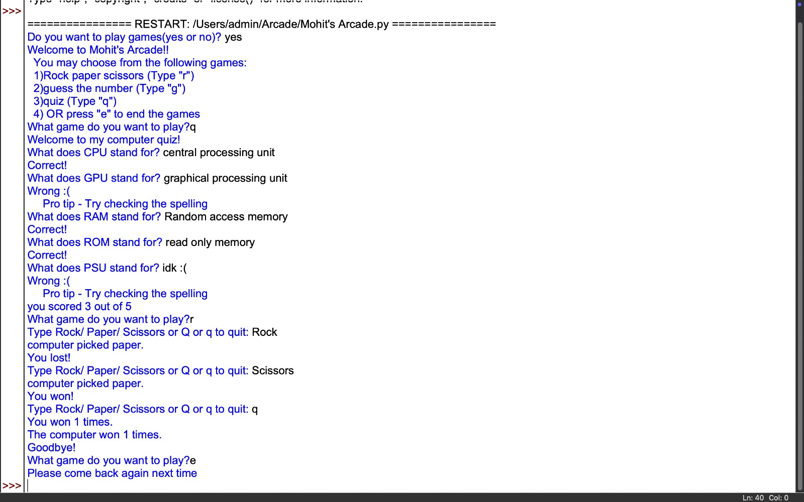

# Welcome to Mohit's Arcade!

## Description  
Mohit's Arcade is a collection of three interactive games coded in Python. This project is designed to provide fun and engaging experiences while practicing basic programming concepts. It features a **Rock-Paper-Scissors Game**, a **Guess the Number Game**, and a **Quiz Game**.

This was my first-ever project, and it holds a special place as a milestone in my programming journey.

---
## Results
<p align="center">
 
</p>

---
## Features  

### 1. **Rock-Paper-Scissors Game**  
Play a classic game of Rock-Paper-Scissors against the computer. The program keeps track of the number of games you win versus the computer's wins. Exit anytime by typing `q`.  

#### Code Explanation:  

```python
def rps():  # rock paper scissors code
    user_wins = 0
    computer_wins = 0
    options = ["rock", "paper", "scissors"]  # Possible choices
    
    while True:
        user_input = input("Type Rock/ Paper/ Scissors or Q to quit: ").lower()
        if user_input == "q":  # Exit the game
            break
        if user_input not in options:  # Validate input
            continue

        random_number = random.randint(0, 2)  # Random computer choice
        computer_pick = options[random_number]
        print("Computer picked", computer_pick + ".")

        # Determine the winner
        if user_input == "rock" and computer_pick == "scissors":
            print("You won!")
            user_wins += 1
        elif user_input == "paper" and computer_pick == "rock":
            print("You won!")
            user_wins += 1
        elif user_input == "scissors" and computer_pick == "paper":
            print("You won!")
            user_wins += 1
        elif user_input == computer_pick:
            print("It's a tie!")
        else:
            print("You lost!")
            computer_wins += 1

    print("You won", user_wins, "times.")
    print("The computer won", computer_wins, "times.")
    print("Goodbye!")
```

---

### 2. **Guess the Number Game**  
Try to guess a randomly generated number within a specified range. The program provides hints whether your guess is too high or too low.  

#### Code Explanation:  

```python
def guess():  # code for guessing game
    top_of_range = input("Type a number: ")
    if top_of_range.isdigit():  # Validate input is a number
        top_of_range = int(top_of_range)
        if top_of_range <= 0:
            print("Please type a number more than zero. ")
            return
    else:
        print("Please type a number next time.")
        return

    random_number = random.randint(0, top_of_range)
    guesses = 0

    while True:
        guesses += 1
        user_guess = input("Make a guess: ")
        if user_guess.isdigit():
            user_guess = int(user_guess)
        else:
            print("Please type a number next time.")
            continue

        if user_guess == random_number:
            print("You got it!")
            break
        elif user_guess > random_number:
            print("Wrong guess, you were above the number!")
        else:
            print("Wrong guess, you were below the number!")
            
    print("You got it in", guesses, "guesses.")
```

---

### 3. **Quiz Game**  
Test your knowledge with a 5-question quiz on computer-related topics. Earn points for each correct answer!  

#### Code Explanation:  

```python
def quiz():  # code for quiz
    print("Welcome to my computer quiz!")
    score = 0

    # Question 1
    answer = input("What does CPU stand for? ").lower()
    if answer == "central processing unit":
        print("Correct!")
        score += 1
    else:
        print("Wrong :(
Pro tip - Try checking the spelling")

    # Question 2
    answer1 = input("What does GPU stand for? ").lower()
    if answer1 == "graphics processing unit":
        print("Correct!")
        score += 1
    else:
        print("Wrong :(
Pro tip - Try checking the spelling")

    # Question 3
    answer2 = input("What does RAM stand for? ").lower()
    if answer2 == "random access memory":
        print("Correct!")
        score += 1
    else:
        print("Wrong :(
Pro tip - Try checking the spelling")

    # Question 4
    answer3 = input("What does ROM stand for? ").lower()
    if answer3 == "read only memory":
        print("Correct!")
        score += 1
    else:
        print("Wrong :(
Pro tip - Try checking the spelling")

    # Question 5
    answer4 = input("What does PSU stand for? ").lower()
    if answer4 == "power supply":
        print("Correct!")
        score += 1
    else:
        print("Wrong :(
Pro tip - Try checking the spelling")

    print("You scored", score, "out of 5.")
```

---

## How to Play  
1. Run the script in a Python environment.  
2. When prompted, choose `yes` to play the games.  
3. Select a game from the menu:  
   - `r`: Rock-Paper-Scissors  
   - `g`: Guess the Number  
   - `q`: Quiz  
   - `e`: Exit the arcade  

---

## Acknowledgments  
This project is a personal milestone as my first programming endeavor. I hope you enjoy playing it as much as I enjoyed creating it!
